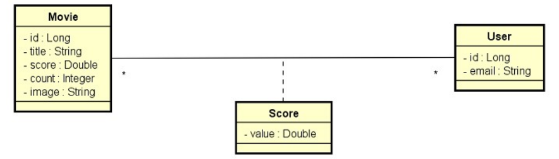

# **Desafio 04 - Curso Java Spring Expert: Módulo 05**

## DSMovie

### Sobre o projeto
Este é um projeto de filmes e avaliações de filmes. A visualização dos dados dos filmes é
pública (não necessita login), porém as alterações de filmes (inserir, atualizar, deletar) são
permitidas apenas para usuários ADMIN. As avaliações de filmes podem ser registradas por
qualquer usuário logado CLIENT ou ADMIN. A entidade Score armazena uma nota de 0 a 5
(score) que cada usuário deu a cada filme. Sempre que um usuário registra uma nota, o
sistema calcula a média das notas de todos usuários, e armazena essa nota média (score) na
entidade Movie, juntamente com a contagem de votos (count).

### Modelo de Domínio

### Enunciado
Deverá implementar os testes unitários comforme está no projeto e o Jacoco deve reportar 100% de cobertura de teste.
  
### Critérios de Correção
- MovieService.findAll() deve retornar uma página de filmes;
- MovieService.findById(id) deve retornar um filme quando o id existir;
- MovieService.findById(id) deve lançar ResourceNotFoundException quando o id não existir;
- MovieService.insert(dto) deve retornar um filme;
- MovieService.update(id, dto) deve retornar um filme quando o id existir;
- MovieService.update(id, dto) deve lançar ResourceNotFoundException quando o id não existir;
- MovieService.delete(id) deve fazer nada quando o id existir;
- MovieService.delete(id) deve lançar ResourceNotFoundException quando o id não existir;
- MovieService.delete(id) deve lançar DatabaseException quando o id for dependente;
- UserService.authenticated() deve retornar um usuário quando houver usuário logado;
- UserService.authenticated() deve lançar UsernameNotFoundException quando não houver usuário logado;
- UserService.loadUserByUsername(username) deve retornar um UserDetails quando o username existir;
- UserService.loadUserByUsername(username) deve lançar UsernameNotFoundException quando o username não existir;
- ScoreService.saveScore(dto) deve retornar os dados do filme quando o id existir;
- ScoreService.saveScore(dto) deve lançar ResourceNotFoundException quando o id do filme não existir.

### Competências avaliadas:
- Testes unitários em projeto Spring Boot com Java;
- Implementação de testes unitários com JUnit e Mockito;
- Cobertura de código com Jacoco.
